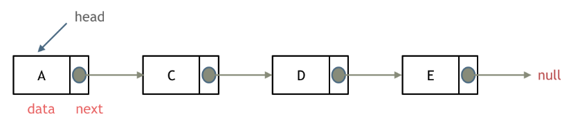
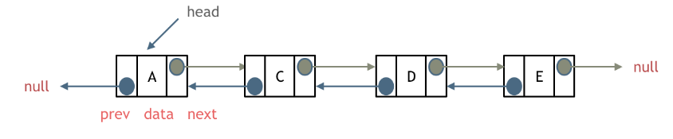
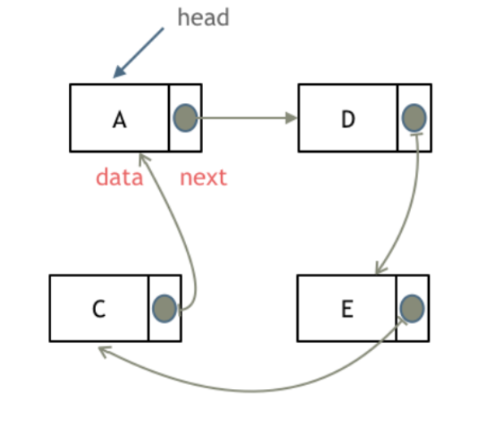
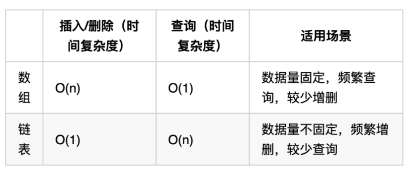

## LinkedList
1. Single Linked List

2. Double Linked List

3. Circle Linked List


* Memory: each node stored in non-consecutive memory locations   
* Complexity: 

* Sample definition in java:
    ```java
    public class ListNode {
        //value
        int val;
        // pointer to the next
        ListNode next;

        public ListNode() {
        }

        public ListNode(int val) {
            this.val = val;
        }

        public ListNode(int val, ListNode next) {
            this.val = val;
            this.next = next;
        }
    }
    ```

## [203. Remove Linked List Elements](https://leetcode.com/problems/remove-linked-list-elements/description/)
O(N) of time complexity. Dummy head.
```java
/**
 * Definition for singly-linked list.
 * public class ListNode {
 *     int val;
 *     ListNode next;
 *     ListNode() {}
 *     ListNode(int val) { this.val = val; }
 *     ListNode(int val, ListNode next) { this.val = val; this.next = next; }
 * }
 */
class Solution {
    public ListNode removeElements(ListNode head, int val) {
        if (head == null) {
            return null;
        }
        ListNode dummyHead = new ListNode(-1, head);
        ListNode prev = dummyHead;
        ListNode curr = head;
        while (prev != null && curr != null) {
            if (curr.val == val) {
                prev.next = curr.next;
            } else {
                prev = curr;
            }
            curr = curr.next;
        }
        return dummyHead.next;
    }
}
```

## [707. Design Linked List](https://leetcode.com/problems/design-linked-list/description/)
Important: corner cases matter, takes long time debugging...
```java
class MyLinkedList {
    private class Node {
        int val;
        Node next;
        Node(int val, Node next) {
            this.val = val;
            this.next = next;
        }
    }

    private Node head;
    private int size;

    public MyLinkedList() {
        head = null;
        size = 0;
    }
    
    public int get(int index) {
        if (index >= size) {
            return -1;
        }
        Node curr = head;
        for (int i = 0; i < index; i++) {
            curr = curr.next;
        }
        return curr.val;
    }
    
    public void addAtHead(int val) {
        addAtIndex(0, val);
    }
    
    public void addAtTail(int val) {
        addAtIndex(size, val);
    }
    
    public void addAtIndex(int index, int val) {
        if (index > size) {
            return;
        }
        if (index == 0) {
            head = new Node(val, head);
            size++;
            return;
        }
        Node curr = new Node(-1, head);
        for (int i = 0; i < index; i++) {
            curr = curr.next;
        }
        curr.next = new Node(val, curr.next);
        size++;
    }
    
    public void deleteAtIndex(int index) {
        if (index >= size) {
            return;
        }
        if (index == 0) {
            head = head.next;
            size--;
            return;
        }
        Node curr = new Node(-1, head);
        for (int i = 0; i < index; i++) {
            curr = curr.next;
        }
        curr.next = curr.next.next;
        size--;
    }
}

/**
 * Your MyLinkedList object will be instantiated and called as such:
 * MyLinkedList obj = new MyLinkedList();
 * int param_1 = obj.get(index);
 * obj.addAtHead(val);
 * obj.addAtTail(val);
 * obj.addAtIndex(index,val);
 * obj.deleteAtIndex(index);
 */
```

## [206. Reverse Linked List](https://leetcode.com/problems/reverse-linked-list/description/)
```java
/**
 * Definition for singly-linked list.
 * public class ListNode {
 *     int val;
 *     ListNode next;
 *     ListNode() {}
 *     ListNode(int val) { this.val = val; }
 *     ListNode(int val, ListNode next) { this.val = val; this.next = next; }
 * }
 */
class Solution {
    public ListNode reverseList(ListNode head) {
        if (head == null || head.next == null) {
            return head;
        }
        ListNode prev = head;
        ListNode curr = head.next;
        while (curr != null) {
            ListNode next = curr.next;
            curr.next = prev;

            prev = curr; 
            curr = next;
        }
        head.next = null;
        return prev;
    }
}
```
